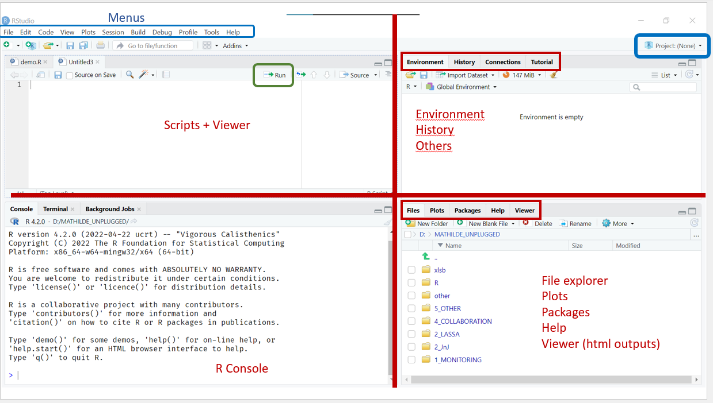
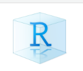
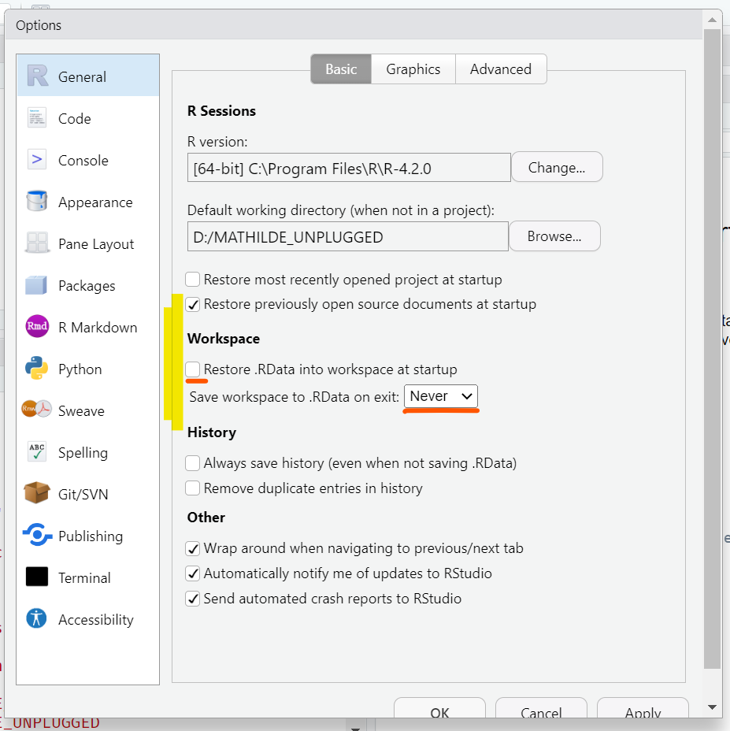

```{r setup}
#| include: false
#| eval: true
knitr::opts_chunk$set(echo = TRUE, eval = FALSE)

library(here) # for file paths
library(rio)  # import and export files

df_linelist <- import(file = here('data', 'scenario', 'TCH_measles',
                                  'raw', 'moissala_linelist_FR.xlsx'))
```

## Objectifs

- Créer un projet RStudio
- Mettre en place un code organisé et bien documenté
- Installer et charger des paquets dans la session
- Ecrire des chemins d’accès aux fichiers robustes
- Importer et inspecter des données dans R

:::{.callout-important}
Les principes vus dans le module FETCH sur la gestion des données s’appliquent aussi à votre code : on souhaite écrire un script qui fonctionne maintenant, mais également dans le futur, et qui soit partageable. Il existe quelques bonnes pratiques qui peuvent nous aider à aller dans cette direction, et la première est d’avoir un code source propre et bien organisé.
:::

## Mise en place du projet

### Structure des dossiers {#folder-structure}

::: {.setup}
Si ce n'est pas déjà fait, téléchargez le dossier du cours décompressez-le. Sauvegardez le dossier non compressé à un endroit [**non connecté à OneDrive**]{.hovertip bs-toggle='tooltip' bs-title="OneDrive ne fonctionne pas bien avec R car il va constamment synchroniser certains fichiers, ce qui peut entraîner des erreurs ou des problèmes de mémoire"} et ouvrez-le.

```{r}
#| echo: false
#| eval: true

downloadthis::download_link(
  link = 'https://github.com/epicentre-msf/repicentre/raw/main/data/FETCHR.zip',
  button_label = ' Dossier du cours',
  has_icon = TRUE,
  icon = "fa fa-save",
  self_contained = FALSE
)
```
:::

Ce dossier illustre une structure typique et recommandée pour vos projets de code :

- 📁 data
  - 📁 raw
  - 📁 clean
- 📁 R
- 📁 outputs

Ce dossier sera votre répertoire de travail pour toutes les sessions de ce cours. Vous y créerez un projet RStudio (explications ci-dessous), et y enregistrerez tous vos scripts (sous dossier `R`). Les données brutes se trouvent déjà dans `data/raw`.

### Définitions {#sec-definitions}

Voici deux concepts importants que nous allons rencontrer dans cette session :

**Répertoire de travail.** Le répertoire de travail est l'emplacement (dossier) où votre session R *en cours* travaille. Si vous enregistrez un fichier, par exemple, il sera enregistré dans ce dossier par défaut. De même, Si vous ouvrez un fichier, ce dossier sera affiché par défaut. Tous les chemins relatifs auront ce dossier pour origine. Par défaut, R choisit généralement votre dossier "Documents" comme répertoire de travail sur les machines Windows.

**Racine.** La racine fait référence au niveau de dossier le plus élevé du répertoire de travail. Si le dossier de votre cours s'appelle `FETCHR` la racine se trouverait directement à l'intérieur de celui-ci (et non dans l'un de ses sous-dossiers comme `R` ou `data`).

### Projets RStudio

Un [projet RStudio]{.hovertip bs-toggle='tooltip' bs-title="Techniquement, c'est un fichier contenant des métadonnées qui indiquent à RStudio quels fichiers ouvrir et quel est le répertoire de travail, ce qui vous évite d'avoir à le définir vous même"} est outil qui va faciliter votre vie et aider RStudio à trouver les différents fichiers.


Pour rappel, votre interface doit ressembler à ceci :

{fig-align="center" #fig-interface}

::: {.setup}
Ouvrez RStudio et suivez ces étapes pour créer un nouveau projet :

- cliquez sur `File > New Project > Existing Directory > Browse`, 
- naviguez jusqu'au dossier du cours (en l'ouvrant) 
- cliquez sur `Create Project`.
:::

::: {.look}
Dans l'explorateur Windows, examinez le dossier du cours. Vous devriez maintenant voir un nouveau fichier avec l'extension `.Rproj` qui a une petite icône bleue avec un R au milieu
:::

{fig-align="center"}

:::{.callout-note}
Si vous ne voyez pas ce fichier, c'est probablement parce qu'il est caché par défaut sur votre ordinateur. Pour modifier ce paramètre dans l'explorateur Windows, allez dans le menu *Afficher* et sélectionnez `Extensions de noms de fichier`.
:::

Lorsque vous ouvrez un projet RStudio, RStudio démarre une nouvelle session R spécifique à ce projet, ouvre les fichiers associés et définit la racine de votre dossier comme répertoire de travail. Une conséquence immédiate est que le panneau *Files* en bas à droite de l'interface montre les sous dossiers présents dans le répertoire de travail, *i.e.* votre dossier de cours.

::: {.callout-tip}
Il est fortement recommandé de mettre en place un projet RStudio distinct pour *chacune* de vos [analyses]{.hovertip bs-toggle='tooltip' bs-title="Ici, un projet d'analyse implique l'ensemble du processus de chargement, de nettoyage, d'analyse et de production de rapports sur un jeu de données."} afin de garantir que les fichiers de vos projets restent organisés.  
:::

Il existe plusieurs façons d'ouvrir un projet RStudio :

- Utilisez le menu RStudio `File > Open Project` puis sélectionnez le fichier `.Rproj` approprié
- Cliquez sur [le bouton `Project: (none)`]{.hovertip bs-toggle='tooltip' bs-title="Examinez ce bouton pour savoir dans quel projet vous travaillez actuellement."} en haut à droite de l'interface RStudio
- Naviguez dans l'explorateur de fichiers Windows jusqu'à votre dossier de cours et double-cliquez sur le fichier avec l'extension `.Rproj`


### Les options de RStudio

Avant de poursuivre, allons modifier certaines des options de RStudio qui peuvent causer des problèmes.

::: {.setup}
Ouvrez les options globales (`Tools > Global Options`) et ouvrez l'onglet `General` (menu de gauche). Déselectionnez toutes les cases des sections `R Sessions`, `Workspace` et `History`.
:::

{fig-align="center"}

Lorsque ces options sont activées, RStudio enregistre les objets de votre environnement et les charge à chaque fois que vous ouvrez une nouvelle session R. Ca semble être une bonne idée, mais il est en fait préférable de toujours commencer votre travail à partir d'une [session R vide]{.hovertip bs-toggle='tooltip' bs-title="Une session vide signifie que l'environnement est vide, mais vos scripts avec toutes les instructions sont toujours là !"} afin d'éviter les erreurs.

:::{.callout-important}
N'oubliez pas que toutes les commandes nécessaires au nettoyage et à l'analyse de vos données doivent être enregistrées explicitement dans un script, dans le bon ordre. Faire retourner le script devrait arriver aux mêmes résultats que précédement.
:::

### Création d'un nouveau script

::: {.setup}
Ouvrez un nouveau script et enregistrez-le dans le sous-dossier `R` de votre projet sous le nom `import_data.R`.

Ajoutez des métadonnées au début du script, comme recommandé lors première session, en utilisant des [commentaires](01_introduction.qmd#sec-comments). Veillez à inclure :

- Le titre
- L'auteur du script
- La date de création
- Une description rapide de ce que fait le script
:::

Nous sommes prêts à commencer à coder

## Paquets {#sec-packages}

Les paquets [*packages*] sont des collections de fonctions qui étendent les fonctionalités de R. Vous en utiliserez un grand nombre pendant ce cours et dans votre travail quotidien. R étant open-souce, les packages sont téléchargeable et utilisable gratuitement.

:::{.callout-note}
Dans ce cours, nous utiliserons une convention commune qui est de référencer les paquets entre `{}`. Par exemple `{ggplot2}` est le nom du paquet ggplot2 qui contient des fonctions pour créer des graphes, telles que `ggplot()`, `geom_point()` etc...
:::

### Installation

La fonction `install.packages()` télécharge et installe un nouveau paquet sur votre ordinateur, dans la bibliothèque de paquets associée à R. Vous n'avez à faire cette opération qu'une seule fois par paquet et ordinateur.

```{r}
#| eval = FALSE
install.packages("here") # installe le paquet {here} 
```

N'oubliez pas de mettre le nom du paquet entre guillemets lorsque vous utilisez la commande `install.packages()`. Que se passe-t-il si vous ne le faites pas ?

::: {.callout-note}
Si vous suivez cette session dans le cadre d'un cours, pour éviter tout problème potentiel de connectivité internet pendant la formation, nous vous avons déjà fait installer la plupart des paquets du cours.

Si vous suivez ce tutoriel seul ou si vous n'avez pas encore installé les paquets, vous devrez installer manuellement chaque nouveau paquet que nous rencontrerons avec la fonction `install.packages()`.
:::

### Utilisation

Une fois qu'un paquet est installé, il faut indiquer à R que nous souhaitons l'utiliser pour une  session donnée en le *chargeant* dans la session avec la fonction `library()`.

```{r}
library(here) # charge le paquet {here} dans la session
```

::: {.write}
Utilisez la fonction `library()` pour charger les paquets `here` et `rio` qui seront utilisés aujourd'hui.
:::

Il se peut que vous obteniez parfois un [message d'avertissement]{.hovertip bs-toggle='tooltip' bs-title="Contrairement aux messages d'erreur, les avertissements n'interrompent pas la commande en cours. Ils signalent des problèmes potentiels non graves, et n'ont pas toujours besoin d'être corrigés."} signalant que certaines fonctions ont été [masquées]{.hovertip bs-toggle='tooltip' bs-title="Le masquage se produit lorsque R essaie de charger plusieurs fonction portant le même nom en même temps. Par exemple, plusieurs paquets contiennent une fonction filter() ou select(). Quand un conflit se produit, R choisit la version qui a été chargée en dernier et les autres versions sont ignorées (masquées)."} ou que la version actuelle du paquet a été construite pour une version différente de R. Ces messages ne doivent pas vous inquiéter, mais il faut les lire et essayer de comprendre ce qui se passe.

::: {.write}
Exécutez le code suivant. Comprenez-vous le message d'erreur ?

```{r}
#| error: true
library(ggplot)
```

:::

Le code ci-dessus génère une erreur car il y a une faute de frappe dans le nom du paquet, et vous avez donc essayé de charger un paquet qui n'existe pas. Rappelez-vous que **R  est pénible, et en particulier est sensible à la casse** : beaucoup de vos erreurs viendront de petites fautes dans les noms de fonctions ou d'objets. Ici, par exemple, nous voulions charger le paquet `ggplot2` mais nous avons écrit `ggplot` à la place.

::: {.callout-tip}
Il est recommandé d'avoir une section au début de votre script qui charge tous les paquets dont vous aurez besoin dans votre script en un seul endroit :

```{r}
# Packages ----------------------------
library(tidyverse)   # manipulation de données
library(lubridate)   # manipulation des dates
```

Celà permet de savoir rapidement quels paquets doivent être installés pour exécuter un script.
:::

::: {.write}
Créez une section "Paquets" dans votre script à l'aide de  [commentaires]{.hovertip bs-toggle='tooltip' bs-title="Vous pouvez utiliser les raccourcis clavier CTRL + MAJ + C and CTRL + MAJ + R pour insérer des commentaires ou des sections"}
:::

### Mettre à jour les paquets

R dispose d'une communauté de développeurs très active et il est assez courant que les paquets soient mis à jour, avec de nouvelles fonctionalités ou des corrections de bugs. Pour mettre à jour les paquets de votre bibliothèque, rendez-vous dans [l'onglet `Packages`]{.hovertip bs-toggle='tooltip' bs-title="Pour rappel, cet onglet affiche la liste de tous les paquets que vous avez installés sur votre ordinateur, avec leur numéro de version."} du panneau inférieur droit et cliquez sur `Update`. N'oubliez pas que vous **devez être connecté à internet** pendant ce processus.

::: {.callout-important}
La mise à jour de certains paquets peut parfois changer le comportement de certaines fonctions, ce qui peut casser votre code. **Pas de panique**. La meilleure pratique consiste à adapter votre code mais, dans le pire des cas, vous pouvez installer une [ancienne version du paquet incriminé]{.hovertip bs-toggle='tooltip' bs-title="Ce qui est généralement déconseillé car cela rend votre code difficile à utiliser par d'autres. Nous n'illustrerons pas la manip ici. Si vous avez à le faire, documentez bien !"}.
:::

## Importation de données

### Trouver son chemin... {#sec-filepaths}

Pour ouvrir un fichier dans R, vous devez fournir un **chemin d'accès au fichier**. Un chemin d'accès est simplement un (long) nom pour un fichier qui inclut son emplacement sur votre ordinateur. Les chemins d'accès peuvent être *absolus* ou *relatifs*.

#### Chemins d'accès absolus

Les chemins d'accès absolus sont **spécifiques à votre ordinateur** et vont jusqu'au niveau de votre [disque dur]{.hovertip bs-toggle='tooltip' bs-title="Par exemple, 'C:' ou 'D:' sur un ordinateur Windows."}. Par exemple : `D:/OneDrive - MSF/Documents/monitoring/cholera/fancy_project/data/raw/example_linelist.xlsx`. Il est clair que ce chemin ne fonctionne que sur un ordinateur particulier.

L'utilisation de chemins absolus [encodés en dur]{.hovertip bs-toggle='tooltip' bs-title="Le codage en dur correspond au fait l'écrire le chemin d'accès en entier, comme dans l'exemple ci-dessus, au lieu de construire le chemins par morceaux comme nous allons voir après"} est **fortement déconseillé** car cela rend votre code fragile et augmente la maintenance : en effet, les chemins devront tous être mis à jour chaque fois quelqu'un d'autre exécute votre code, ou que le dossier du projet est déplacé sur votre ordinateur.

#### Chemins d'accès relatifs

Les chemins relatifs sont définis par rapport à votre [répertoire de travail](../sessions_core/02_import_data.qmd#sec-definitions). 
Comme l'emplacement du fichier `.Rproj` définit le répertoire de travail, les chemins sont relatifs à cette racine. Pour vous, un chemin relatif ressemblera à ça : `data/raw/example_linelist.xlsx`.

Cela signifie que tant que la **structure interne du dossier** contenant votre projet est préservée, le chemin d'accès relatif sera valable quelque soit l'ordinateur.


#### Chemins d'accès robustes avec la fonction `here()`

Le paquet `{here}` dispose d'une fonction `here()` qui aide à créer des chemins d'accès. Elle présente deux avantages :

- Elle détecte la présence d'un fichier `.Rproj` et est capable de construire un *chemin absolu* à partir d'un *chemin relatif* dans votre projet RStudio.

- Elle choisit automatiquement le séparateur adapté à votre [système d'exploitation]{.hovertip bs-toggle='tooltip' bs-title="Par exemple, Windows, MacOS, Debian..."} : `/`, `\` ou `//`.

```{r}
#| eval: true
library(here)
here("data", "raw", "example_linelist.xlsx")
```


```{r}
#| eval: true
library(here)
here("data", "raw", "example_linelist.xlsx")
```

Voyez comme nous n'avons défini que le chemin relatif et la fonction a reconstitué le chemin absolu. Celà marchera donc sur l'ordinateur d'un collègue, y compris sur un autre système d'exploitation, du moment que la structure du répertoire de travail est intacte.

Nous vous **encourageons fortement** à utiliser `here()` chaque fois que vous devez créer un chemin d'accès à un fichier.

::: {.write}
Exécutez le code ci-dessus dans la console. Quel chemin d'accès `here("data", "raw")` vous donne-t-il ?
:::

::: {.write}
Utilisez `here()` pour créer le chemin vers le fichier `moissala_linelist_FR.xlsx`.
:::

::: {.callout-important}
`here()` crée une chaîne de caractères contenant l'adresse d'un fichier, mais ne vérifie pas si ce fichier *existe réellement* sur votre ordinateur. Si le fichier est absent ou s'il y a une faute de frappe dans votre code, vous obtiendrez une erreur lors de *l'utilisation* du chemin ainsi créé. Vous pouvez tester si un fichier existe à cette adresse avec la fonction `file.exists()`.
:::

::: {.callout-tip}
On veut souvent définir plusieurs chemins dans un projet (données brutes, données propres, où sauver les graphes etc.). C'est une bonne pratique que de créer une nouvelle section au début de votre script, après le chargement des paquets, pour définir et stocker les chemins d'accès dans des objets.
:::

### Importer les données {#sec-import}

Dans R, différents formats de fichiers sont importés par différentes fonctions spécialisées, ce qui est fastidieux à mémoriser et à charger. La fonction `import()` du paquet [`{rio}`]{.hovertip bs-toggle='tooltip' bs-title="Pour R Input and Output, c'est à dire entrées et sorties dans R"} nous fait gagner du temps en reconnaissant l'extension des fichiers et en [appellent automatiquement une fonction spécialisée]{.hovertip bs-toggle='tooltip' bs-title="Ce type de fonction, qui fournit une interface unifiée à d'autres fonctions spécifiques, est connu sous le nom de 'wrapper', c'est à dire 'emballage'."} pour charger les données.

Comme `import()` ne fait qu'appeler d'autres fonctions en arrière-plan, il est possible qu'elle ait besoin d'arguments optionnels spécifiques pour certains types de fichier.

::: {.callout-tip}
La (longue) liste des types de fichiers pris en charge par {rio} est sur le [site du paquet](https://gesistsa.github.io/rio/index.html#supported-file-formats). Dans la suite de la leçon, nous nous concentrerons sur l'importation de données à partir de fichiers Excel `.xlsx`.
:::

#### Import de la première feuille

Au minimum la fonction `import()` a besoin qu'on lui donne le chemin du fichier avec l'argument `file` :

```{r}
import(file = here("data", "raw", "example_linelist.xlsx"))
```

Notez que nous avons imbriqué la commande `here()` **à l'intérieur de** la commande `import()`. L'imbrication de fonctions est autorisée et même courante en R. R évalue les fonctions imbriquées de l'intérieur (`here()`) à l'extérieur (`import()`). La valeur renvoyée par `here()` est donc utilisée comme *valeur d'entrée* d'`import()`.

::: {.write}
Importez le fichier `moissala_linelist_FR.xlsx` en utilisant `here()` et `import()`.
:::

Si votre importation a fonctionné correctement, R affichera les données dans la console mais ne les enregistrera pas dans l'environnement car nous ne [les avons pas assignées à un objet](../sessions_core/01_introduction.qmd#sec-assignement-operator).

::: {.write}
Réimportez vos données, mais cette fois-ci, sauvegardez-les dans un objet appelé `df_linelist`.
:::

::: {.callout-tip}
Si votre jeu de données est très gros, il vaut mieux éviter de l’afficher dans la console…
:::

#### Import d'une autre feuille

Comme vous venez de le voir, la fonction `import()` importe la première feuille d'un fichier Excel par défaut. Il est cependant possible de passer le numéro de la feuille ou son nom (en chaîne de caractères) à l’argument `which` :

```{r}
import(file = here("data", "raw", "example_linelist.xlsx"),  # chemin
       which = 2)                                            # spécifie la deuxième feuille
```

Notez que l'argument `which` est spécifique aux types de fichiers comportant plusieurs feuilles, tels que les fichiers Excel ou .Rdata. Si vous essayez de l'utiliser sur un fichier `.csv` l'argument sera ignoré.

## Aperçu des données

Nous avons importé un jeu de données dans R et l’avons assigné à un objet (`df_linelist`). 
Nous pouvons maintenant inspecter le data frame créé pour vérifier que l'export s'est bien passé, et commencer à évaluer le nettoyage à faire.

Nous pouvons commencer par jeter un coup d'œil rapide aux premières lignes du data frame à l'aide de la fonction `head()`. Son premier argument est le data frame à inspecter et le second, `n`, accepte un nombre de lignes à afficher (optionnel).

```{r}
head(df_linelist, n = 10) # Affiche les 10 premières lignes
```

::: {.write}
Utilisez `head()` pour examiner les 12 premières lignes de `df_linelist`.
:::

Nous pouvons inspecter la [structure]{.hovertip bs-toggle='tooltip' bs-title="Cela revient á utiliser la commande `str()` sur le data frame"} du data frame à partir de l'onglet *Environnement* dans le panneau supérieur droit.  Nous pouvons également visualiser le data frame dans le le visualiseur de données de RStudio (en haut à gauche).

::: {.look}
Cliquez sur le bouton rond bleu à côté de `df_linelist` dans votre environnement pour examiner sa structure. Cliquez ensuite sur le nom du data frame pour le visualiser.
:::

Le visualiseur permet d’afficher le data frame comme dans un tableur et est un moyen pratique d'examiner rapidement vos données. Vous pouvez trier et filtrer vos données dans cet onglet mais ces actions ne modifieront pas l'objet `df_linelist`. Le visualiseur peut également être ouvert en utilisant directement la fonction `View()` sur le data frame.

## C'est fini !

Bravo et n'oubliez pas de sauvegarder votre code !

```{r}
#| echo: false
#| eval: true

downloadthis::download_link(
  link = 'https://github.com/epicentre-msf/repicentre/blob/main/sessions_core/02_import_data_solutions_fr.R',
  button_label = 'Solutions exercices',
  has_icon = TRUE,
  icon = "fa fa-save",
  self_contained = FALSE
)
```

## Pour aller plus loin

### Exercices supplémentaires

1. Utilisez `dim()` pour examiner les dimensions de votre data frame.
2. Utilisez `str()` pour vérifier le type de données de chaque colonne. Voyez-vous quelque chose d'étrange ? N'oubliez pas que vous pouvez également utiliser des fonctions telles que `is.character()` et `is.numeric()` si vous souhaitez tester le type d'une colonne particulière.
3. En utilisant une fonction apprise lors de la première session, pouvez-vous extraire les noms des colonnes du data frame ? Ces résultats correspondent-ils à ce que vous voyez lorsque vous ouvrez les données dans Excel ?
4. Essayez d'exécuter la fonction `summary()` sur votre data frame. Qu'est ce que le résultat vous apprend sur les variables ?

### Ressources complémentaires

- Le [site web](https://gesistsa.github.io/rio/index.html#supported-file-formats) de `{rio}`
- [Plus d'exemples](https://epirhandbook.com/fr/new_pages/importing.fr.html) sur l'importation de données de différents types de fichiers


