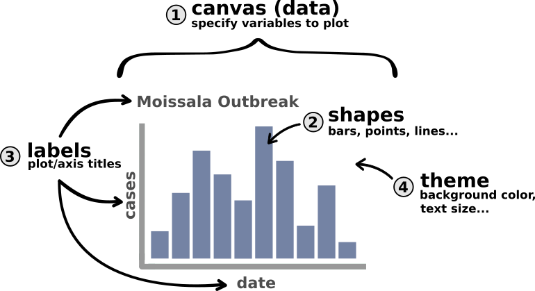
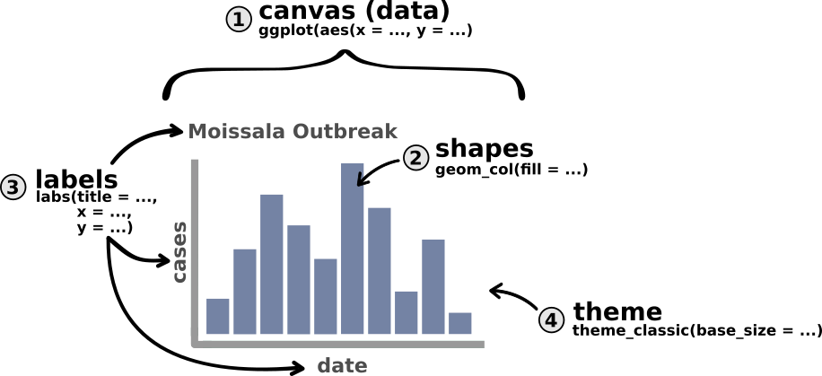
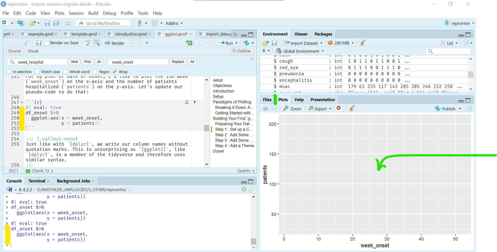
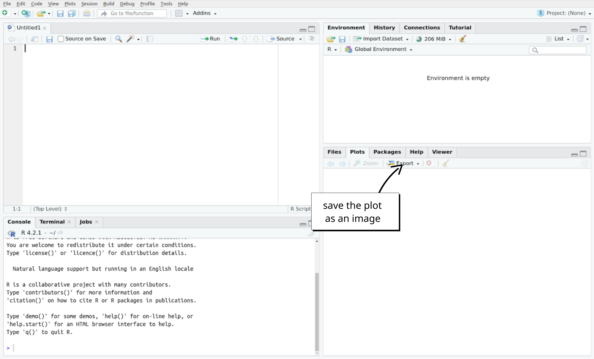

```{r setup}
#| include: false
#| eval: true

knitr::opts_chunk$set(echo = TRUE, eval = FALSE)

library(dplyr)       # Data manipulation
library(lubridate)   # Deal with dates
library(ggplot2)     # Todays workhorse


# Data
df_linelist <- rio::import(here::here('data', 'clean',
                                      'moissala_linelist_clean_FR.rds')) 


# Their summarized dataset
df_cases <- df_linelist |>
  count(date_debut)

# Data for our examples
df_hopital <- df_linelist |>
  mutate(date_admission = ymd(date_admission)) %>% 
  count(date_admission, 
        name = 'patients') |>
  tidyr::drop_na(date_admission)
```

## Objectifs

- S'initier aux bases de la visualisation de données en R avec le paquet `{ggplot2}`
- Construire une courbe épidémique simple  

## Introduction

Cette session introduit les concepts de base pour créer des graphiques avec un paquet populaire, `{ggplot2}`. Il ne sera pas possible de tout traiter en trois heures : visualiser les données est un vaste sujet et `{ggplot2}` en particulier est très puissant. Nous nous focaliserons sur une initiation aux concepts de base en créant le graphique le plus connu en épidémiologie, la **[courbe épidémique]{.hovertip bs-toggle='tooltip' bs-title="Une courbe épidémique montre le nombre journalier ou hebdomadaire de cas observés pendant une épidémie. C'est un graphique très utilisés en épidémiologie. Il peut être complexifiés en ajoutant le statut du cas, son type de décharge, etc."}**.

Notre visualisation finale ressemblera à ceci :

```{r}
#| eval: true
#| echo: false

df_linelist |>
  count(date_debut) |> 
  ggplot(aes(x = date_debut,
             y = n)) +
  geom_col(fill = "#2E4573") +
  labs(x = "Début des symptomes",
       y = "Cas",
       title = "Cas de rougeole dans la région de Mandoul, (Tchad)") +
  theme_classic(base_size = 15)
```


Mise en place
----------------------------------------------------------------------------------------------------

**Prérequis** Cette leçon part du principe que vous savez utiliser RStudio, êtes capable d'importer des données et connaissez les verbes de base du traitement des données. Rafraîchissez-vous si besoin sur les [leçons précédentes](https://epicentre-msf.github.io/repicentre//fr/pathway.html).

::: {.setup}
Cette session utilisera la version nettoyée de la liste linéaire rougeole à Mandoul

```{r}
#| echo: false
#| eval: true

downloadthis::download_link(
  link = 'https://github.com/epicentre-msf/repicentre/raw/main/data/FETCHR.zip',
  button_label = ' Course Folder',
  has_icon = TRUE,
  icon = "fa fa-save",
  self_contained = FALSE
)
```
<br>
Ouvrez le projet Rstudio du cours et créez un nouveau script appelé "courbe_epi.R" avec les métadonnées appropriées. Enregistrez le dans `R/`. Pour cette leçon, nous aurons besoin de charger les paquets `{here}`, `{rio}`, `{dplyr}`, `{lubridate}`, et`{ggplot2}`. Ajoutez une section `# IMPORT DONNÉES` où vous importez les données nettoyées du cours (`linelist_moissala_clean_FR.RDS`). 
:::


## Les paradigmes de la création de graphiques

Il y a plusieurs manières d'approcher la visualisation de données en général et en R en particulier. Les deux paradigmes les plus connus sont :

- **Tout en un** :  cette approche est caractérisée par l'existence d'une fonction (souvent complexe) pour gérer tous les aspects de la construction d'un graphique. Base R par exemple, utilise cette approche (et ce n'est pas le seul).

- [**Graphiques modulaires / en couches**]{.hovertip bs-toggle='tooltip' bs-title="Ce paradigme est parfois surnommé 'la grammaire des graphiques', en référence au titre du livre qui en a jeté les fondements."} : le graphique est décomposé en éléments (formes, titres, barres d'erreurs, thèmes...) associées à des couches. Différentes fonctions ajoutent ou modifient ces éléments. Ce paradigme est utilisé par les paquets `{ggplot2}`, `{highcharter}`, ou `{echarts4r}` et un certain nombre d'autres outils modernes.

Une discussion approfondie des avantages et inconvénients de chacune des approches dépasse le cadre de ce cours. Néanmoins, on peut noter que la plupart des outils de visualisation modernes utilisent l'approche [en couches]{.hovertip bs-toggle='tooltip' bs-title="Cette approche est plus pratique pour créer des visualisations complexes et personnalisées"}. Gardons cela à l'esprit, et découvrons ce que sont les fameuses "couches" de l'approche modulaire.


### Décomposition d'un graphique

Dans ce tutoriel, nous décomposons les graphiques en quatre composantes (nos couches) : 

1. Le **canevas** / les **données**
2. Les **formes** géométriques primaires
3. Les **titres et labels**
4. Le **thème**

On peut illustrer ces composantes avec la courbé épidémique schématique suivante :

{fig-align="center"}

La première couche, le canevas est fondamentale. Tel un artiste qui prépare sa toile vierge et ses outils avant de se lancer dans une peinture, R doit d'abord créer un canevas prêt à accueillir les éléments de représentation graphique. C'est *en créant le canevas que nous indiquons à R que nous allons créer un graphique, et avec quelles variables sur quel axe*. Une fois ce canevas mise en place, nous ajouterons d'autres couches, comme un artiste ajouterait de la peinture, leur signature ou un cadre.


### Structure d'un `ggplot` 

La recette pour construire un [`ggplot`]{.hovertip bs-toggle='tooltip' bs-title='Surnom donné à un graphique crée avec le paquet {ggplot2}.'} est simple : 

1. Création d'un canevas à l'aide du duo de fonctions `ggplot(aes(...))`  
2. Ajout de couches au canevas avec l'opérateur `+`  

La syntaxe générale d'un `ggplot` est donc :

```{r}
# NE PAS EXÉCUTER (PSEUDO-CODE)
df |>                    # passer les données
  ggplot(aes(x = ...,    # étape 1 : créer le canevas
             y = ...)) +
  couche_1(...) +        # étape 2 : ajout de la première couche
  couche_2(...) +        # étape 3 : ajout d'une autre couche
  ...                    # continuer à ajouter des couches...

```

Le nombre de couches à ajouter dépend de la complexité du graphique que vous souhaitez créer. Dans notre cas, nous ajouterons trois couches en utilisant les fonctions suivantes : 

```{r}
# NE PAS EXÉCUTER (PSEUDO-CODE)
df |>                    # passer les données
  ggplot(aes(x = ...,    # étape 1 : créer le canevas

             y = ...)) +
  geom_col(...) +        # étape 2 : ajout des formes (barres)
  labs(...) +            # étape 3 : ajouter des titres
  theme_classic(...)     # étape 4 : amélioration du thème
```

Nous pouvons mettre à jour notre précédent schéma avec ces fonctions : 

{fig-align="center"}

::: {.callout-note}
Notez que l’on passe le jeu de données à la fonction `ggplot()` à l'aide de l'opérateur **pipe**, comme nous l'avons fait précédement. Ça fonctionne ici aussi car `ggplot ()` a besoin de connaître le data frame contenant les variables à représenter. **Mais attention** à ne pas utiliser un `+` à la place du `|>` par confusion, cela générera rera une erreur.
:::

Dans la section suivante, nous allons décrire les différentes composantes du graphique plus en détail, pour créer notre première courbe épidémique de la rougeole à Mandoul.


## Votre premier `ggplot` {#sec-epicurve-steps}

### Préparer les données : agrégation par jour

Vous savez que les données de la linelist sont quotidiennes, mais qu'il est possible d'avoir plusieurs cas par jours. Donc, si nous voulons tracer une courbe des *cas quotidiens*, il faut agréger les données par jour. Heureusement, vous avez appris à résumer les données lors de la [session précédente](https://epicentre-msf.github.io/repicentre//fr/sessions_core/05_summary_table.html) !

::: {.write}
Utilisez `count()` pour créer un nouveau data frame appelé `df_cases` qui résume le nombre total de cas observés par jour de début des symptomes. Le début du data frame devrait ressembler à ceci :

```{r}
#| echo: false
#| eval: true
head(df_cases)
```

:::


Top ! Nos données sont prêtes à être utilisées.

Dans les étapes suivantes, *vous* vous utiliserez `df_cas` pour tracer une courbe épidémique du *nombre de cas par jours*. Mais le *tutoriel* illustra le fonctionnement des fonctions en traçant le *nombre d’hospitalisations quotidiennes*. À cet effet, nous créons un data frame `df_hopital` qui ressemble à ceci : 

```{r}
#| echo: false
#| eval: true
head(df_hopital)
```


### Créer le canevas

La première étape consiste à créer votre "canevas" en spécifiant le jeu de données et le nom des colonnes que vous voulez représenter sur le graphique. Cela est fait à l'aide de la fonction `ggplot(aes())` selon la syntaxe suivante :

```{r}
# NE PAS EXÉCUTER (PSEUDO-CODE)
df_data |>
  ggplot(aes(x = variable_axe_x,
             y = variable_axe_y))
```

Pour la courbe épidémique des hospitalisations nous voulons les jours sur l'axe des x (`date_admission`) et le nombre de patients (`patients`) sur l'axe des y :

```{r}
#| eval: true
df_hopital |>
  ggplot(aes(x = date_admission,
             y = patients))
```

Lorsque vous exécutez le code, ce graphique devrait apparaître dans l'onglet "Plots" dans le panneau en bas à droite (par défaut) de RStudio : 

{fig-align="center"}

Nous avons donc un canevas vide, prêt à accueillir nos données !

::: {.callout-note}
Comme avec les fonctions de `{dplyr}`, il n’y a pas besoin d’utiliser des guillemets pour écrire les noms des colonnes. Ce n’est pas surprenant, `{ggplot2}` fait également partie de l’écosystème de paquets `{tidyverse}`, qui a harmonisé sa syntaxe.
:::

Ok, mais c’est quoi ce `aes()` imbriqué dans la fonction `ggplot()` ? Cette fonction, qui n’est utilisée que dans la fonction `ggplot()`, sert à faire correspondre les *variables* du jeu de données aux *éléments visuels du graphique* tels que les axes [en anglais cette correspondance est nommée "mapping", et "aes" vient du terme "aesthetic", traduit par "esthétique"]. Les plus basiques de ces éléments graphiques sont les **axes**, mais on peut aussi définir comment la couleur ou la taille d'éléments varie en fonction de variables dans les données (par exemple, statut à la sortie).


::: {.write}
Créez une nouvelle section `# PLOT COURBE EPI` puis créer un graphe (vide pour le moment) avec le data frame `df_cas`, et les axes en x et y appropriés.
:::

Pour le moment, le résultat devrait ressembler à ceci :

```{r}
#| eval: true
#| echo: false
df_cases |>
  ggplot(aes(x = date_debut,
             y = n))
```


### Ajouter des formes

Maintenant que la toile est prête, nous pouvons dessiner dessus et ajouter des formes. Dans `{ggplot2}`, les formes géométriques sont surnommées des ["géométries"]{.hovertip bs-toggle='tooltip' bs-title="Vous verrez que les fonctions de toutes les géométries commence par 'geom_'. Cette homogénéité de la syntaxe améliore grandement la lisibilité !"} ou "geom" en raccourci, et représentent les données. Les geoms les plus courants sont : 

- [Diagrammes en bâtons]{.hovertip bs-toggle='tooltip' bs-title="Dont les courbes épidémiques..."} (`geom_col()` or `geom_bar()`)
- Histogrammes (`geom_histogram()`)
- Nuages de points (`geom_point()`)
- Courbes (`geom_line()`)
- Boîtes à moustache (boxplots) (`geom_boxplot()`)

Aujourd'hui nous allons nous concentrer sur les diagrammes en bâtons pour créer une courbe épidémique. Nous allons pour celà utiliser la [fonction `geom_col()`]{.hovertip bs-toggle='tooltip' bs-title="La différence entre geom_bar() et geom_col() est que geom_col() fonctionne sur des données déjà agrégées alors que geom_bar() prend des données non-agrégées et les agrège elle même."}. 

Rajoutons les barres à la courbe des cas hospitalisés. Rappelez-vous que l'on ajoute une nouvelle couche à notre objet ggplot à l'aide de `+`.

```{r}
#| eval: true
#| fig-width: 10

df_hopital |>
  ggplot(aes(x = date_admission,
             y = patients)) +
  geom_col()
```

Ça commence à ressembler à une courbe épi, bien qu'elle soit un peu... grise... Nous pouvons heureusement changer la couleur de remplissage des barres avec en passant [l'argument `fill`]{.hovertip bs-toggle='tooltip' bs-title="Les couleurs peuvent être spécifiées de plusieurs façons dans {ggplot2}. Ici, nous utilisons un 'hex code' (internet est votre ami), qui donne un code unique à chaque couleur. Vous pouvez également spécifier des couleurs simples par leur nom. Par exemple, des arguments comme 'blue' ou 'green' sont acceptés."} à `geom_col()`. 


```{r}
#| eval: true
#| fig-width: 10


df_hopital |>
  ggplot(aes(x = date_admission,
             y = patients)) +
  geom_col(fill = "#2E4573")
```

::: {.write}
Mettez à jour votre graphe pour ajouter des barres de couleur `#2E4573`.
:::

Votre graphe devrait ressembler à ceci : 

```{r}
#| eval: true
#| echo: false
#| fig-width: 10

df_cases |>
  ggplot(aes(x = date_debut,
             y = n)) +
  geom_col(fill = "#2E4573")
```


::: {.callout-note}
Dans `{ggplot2}`, les couches **doivent** être ajoutées à un objet ggplot existant (le canevas). Exécuter la fonction `geom_col()` toute seule ne produira pas un graphe. Si l'on reprend l’analogie de la peinture, ce serait comme essayer d'utiliser de la peinture sans support (toile).
:::

L’apparence du graphique s’améliore. Maintenant il est temps de le rendre plus informatif.


### Ajouter les titres

Un bon graphique doit avoir des titres et des étiquettes informatifs or pour le moment, ce n'est pas le cas de notre œuvre (`n` n'est pas très informatif). 

La fonction `lab()` permet d'ajouter facilement des titres et et étiquettes à plusieurs éléments du graphique : 

- Titre / étiquettes des axes (`x = ` et`y = `)
- Titre du graphique (`title = `)
- [Légende]{.hovertip bs-toggle='tooltip' bs-title="Qui peut être utilisée pour indiquer la source des données, par exemple."} (`caption = `)

Comme pour les autres couches, on ajoute la couche `lab()` à notre graphe avec le signe `+` :

```{r}
#| eval: true
#| fig-width: 10

df_hopital |>
  ggplot(aes(x = date_admission,
             y = patients)) +
  geom_col(fill = "#2E4573") +
  labs(x = "Date",
       y = "Patients / jour",
       title = "Hospitalisations pour rougeole dans la région de Madoul (Tchad)")
```

::: {.write}
Ajoutez des titres raisonnables à votre graphe.
<br>
**Bonus.** Ajoutez une source des données en utilisant `caption`.
:::

Votre graphe peut ressembler à ceci (par exemple) :

```{r}
#| eval: true
#| echo: false
#| fig-width: 10

df_cases |>
  ggplot(aes(x = date_debut,
             y = n)) +
  geom_col(fill = "#2E4573") +
  labs(x = "Date de début des symptomes",
       y = "Nombre de cas",
       title = "Cas de rougeole dans la région de Mandoul (Tchad)",
       caption = "Source : données de linelist simulées")
```

### Changer le thème

Si vous explorez vos données, vous pourriez vous arrêter ici. En revanche, si vous voulez utiliser votre graphique dans des rapports ou des présentations, il faut faire un effort d’apparence. En effet, le thème par défaut de ggplot n'est pas très attractif, et la taille des polices est trop petite pour être lisible sur la majorité des supports.

Il suffit d'ajouter une couche "thème" à notre graphe (la dernière couche que nous aborderons dans cette leçon). Si le nom des fonctions des geoms commençait toujours par `geom_`, le nom de toutes les fonctions de thème commence par `theme_`. Il existe plusieurs thèmes prédéfinis que vous pouvez les découvrir sur le [site de `{ggplot2}`](https://ggplot2.tidyverse.org/reference/ggtheme.html). 

Aujourd'hui, nous allons utiliser `theme_classic()`, qui offre une alternative élégante au thème de base :


```{r}
#| eval: true
#| fig-width: 10

df_hopital |>
  ggplot(aes(x = date_admission,
             y = patients)) +
  geom_col(fill = "#2E4573") +
  labs(x = "Date",
       y = "Patients par Jour",
       title = "Hospitalisations pour rougeole dans la région de Madoul (Tchad)") +
  theme_classic()
```

Maintenant, nous allons augmenter la taille des éléments texte en [ajustant la taille de la "police de base"]{.hovertip bs-toggle='tooltip' bs-title="La 'base size' en anglais est la taille de police utilisée comme base pour calculer toutes les tailles de police sur le graphique. Si elle est augmente, tous les éléments de texte sont plus gros, et ce de manière proportionnelle."} à l'aide de l'argument `base_size` :

```{r}
#| eval: true
#| fig-width: 10

df_hopital |>
  ggplot(aes(x = date_admission,
             y = patients)) +
  geom_col(fill = "#2E4573") +
  labs(x = "Date",
       y = "Patients par Jour",
       title = "Hospitalisations pour rougeole dans la région de Madoul (Tchad)") +
  theme_classic(base_size = 17)
```

Ça sera beaucoup mieux dans vos diapos, croyez-nous !

En général, retenez qu’il faut ajuster la taille de la police en fonction de la destination du graphe : présentation, exploration informel, rapport final etc. Il en va de même pour le choix du thème, qui reste un choix partiellement subjectif. Quelques grands principes de lisibilité guident vos choix, mais la visualisation de données est autant un art qu'une science.

::: {.write}
Ajoutez une dernière couche à votre graphe pour ajouter un thème de votre choix, avec une taille de police plus appropriée.
:::


### Sauvegarder votre graphique

Si vous souhaitez enregistrer votre graphe, vous pouvez cliquer sur le bouton « Exporter » dans le panneau des graphiques de RStudio :

{fig-align="center"}


## C’est fini !

Bravo! Vous avez créé votre première courbe épidémique avec R ! 

```{r}
#| echo: false
#| eval: true

downloadthis::download_link(
  link = 'https://github.com/epicentre-msf/repicentre/blob/main/sessions_core/06_epicurves_solutions_fr.R',
  button_label = 'Solutions file',
  has_icon = TRUE,
  icon = "fa fa-save",
  self_contained = FALSE
)
```


Aller plus loin
----------------------------------------------------------------------------------------------------

### Exercices supplémentaires

1. Utilisez le `theme_minimal()` sur un de vos graphiques, avec une taille de police de base de 18.
2. Allez sur [ce site](https://r-charts.com/colors/), choisissez une couleur et modifier la couleur de vos barres.

### Défi

Au lieu d'agréger les données par date, comptez le nombre de patients par sous-préfecture et créez le graphe associé, qui montre le nombre de patients par sous-préfecture.


### Satellites

- [Courbes épidémiques hebdomadaires](../sessions_extra/weekly_epicurves.qmd)
- [Graphiques multiples (facetting)](../sessions_extra/faceting.qmd)
 

## Ressources

- Un [livre complet](https://ggplot2-book.org/) sur l'utilisation de `{ggplot2}` (en anglais). 
- Un [chapitre entier](https://www.epirhandbook.com/fr/new_pages/epicurves.fr.html) en français sur les courbes épidémiques (mais n’hésitez pas à parcourir les chapitres précédents pour en apprendre plus sur les graphiques avec `{ggplot2}`).
